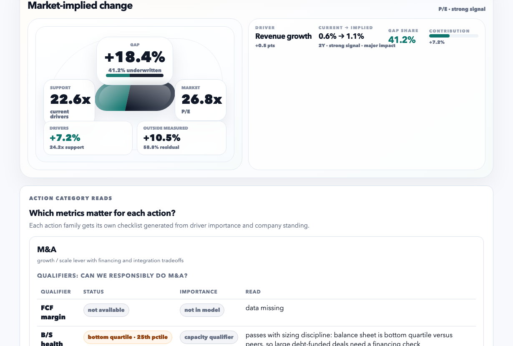
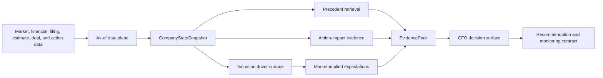

# Axiom

### Decision intelligence for corporate finance

Axiom turns point-in-time company data, peer context, market pricing, historical transactions, and action-impact evidence into recommendations a CFO, banker, or investment committee can interrogate.

This is not a dashboard wrapper or a single prediction model. It is an evidence system: every important output carries its timing, provenance, confidence, limitations, and supporting historical context.



## What Axiom does

- **Builds an auditable company state** from financial, market, filing, macro, and corporate-action inputs.
- **Explains valuation differences** with peer-relative driver surfaces rather than an unexplained score.
- **Separates priced expectations from residuals** so a premium or discount is not forced into a story the data cannot support.
- **Retrieves historical precedents** using learned distance weights, regime context, outcome cohorts, and mismatch diagnostics.
- **Evaluates action evidence** across market, valuation, credit, and operating outcomes with explicit quality gates.
- **Packages evidence for decisions** through structured evidence packs, recommendation contracts, monitoring triggers, and board-ready dossiers.

## Why the engineering is difficult

Corporate-finance decisions fail quietly when the data is not aligned to the decision date. Axiom is designed around the difficult parts:

1. **Point-in-time correctness** — features are built from what was available at the time, not from a later revised dataset.
2. **Traceability** — every feature records provenance, confidence, units, fallback behavior, and timing.
3. **Evidence separation** — explanatory valuation relationships are kept distinct from forward expectation claims and causal claims.
4. **Honest uncertainty** — thin precedent or action families fall back to broader evidence instead of receiving false precision.
5. **Decision translation** — model output becomes sizing guidance, objections, regret cases, and monitoring triggers rather than a chart with no action.

## Architecture



Read the system map in [docs/architecture.md](docs/architecture.md).

## Core modules

| Layer | Implementation | Role |
|---|---|---|
| Company state | [`src/company_state_builder.py`](src/company_state_builder.py) | Builds as-of snapshots from normalized inputs. |
| State contracts | [`src/company_state_validation.py`](src/company_state_validation.py) | Enforces provenance, confidence, fallback, and invariant checks. |
| Evidence packaging | [`src/evidence_pack.py`](src/evidence_pack.py) | Carries citations, cohorts, objections, and action cards into downstream output. |
| Precedent retrieval | [`src/pipeline/precedent_brain.py`](src/pipeline/precedent_brain.py) | Finds and scores comparable historical actions. |
| Learned similarity | [`src/pipeline/precedent_distance_v2_learning.py`](src/pipeline/precedent_distance_v2_learning.py) | Learns distance weights by objective and action family. |
| Action evidence | [`src/causal_impact_model.py`](src/causal_impact_model.py) | Scores action-impact evidence with calibration and risk controls. |
| Decision dossier | [`src/board_ready_dossier.py`](src/board_ready_dossier.py) | Shapes evidence into a decision-ready dossier. |
| Run orchestration | [`src/recommendation_run_orchestrator.py`](src/recommendation_run_orchestrator.py) | Produces reproducible end-to-end recommendation runs. |
| Static demo | [`scripts/build_valuation_action_bridge.py`](scripts/build_valuation_action_bridge.py) | Materializes the valuation/action view from committed sample inputs. |

## Start with the examples

The repository includes four small, reviewable examples that expose the system's major layers without requiring private data-provider accounts.

| Example | Demonstrates |
|---|---|
| [Market expectations](examples/hd_market_expectations/README.md) | Valuation-gap decomposition and forward driver expectations. |
| [Company state snapshot](examples/company_state_snapshot/README.md) | As-of features with provenance, confidence, units, and fallback flags. |
| [Precedent retrieval](examples/precedent_retrieval/README.md) | Historical action analogs, cohort outcomes, and mismatch diagnostics. |
| [CFO decision surface](examples/cfo_decision_surface/README.md) | Sizing, risk, regret, recommendation, and monitoring layers. |

Rebuild the flagship static example:

```bash
python scripts/build_hd_market_expectations_demo.py
open examples/hd_market_expectations/build/valuation_action_bridge.html
```

Print a compact contract check for all committed examples:

```bash
python scripts/inspect_showcase_gallery.py
```

## Validation standard

Axiom treats validation as part of the product, not an afterthought. The public checks emphasize:

- point-in-time inputs and no look-ahead leakage
- walk-forward evaluation where the claim is temporal
- placebo or baseline comparisons for expectation claims
- model-family quality gates before evidence becomes a recommendation
- explicit limitations when samples are thin or a mechanism is not identified

See the [validation overview](docs/validation/README.md), [data contract](docs/data_contract.md), and [model monitoring notes](docs/model_monitoring.md).

## Quickstart

```bash
python -m pip install -e . pytest
python -m pytest -q tests/test_public_showcase_examples.py tests/test_hd_market_expectations_demo.py
```

The GitHub Actions workflow runs the same public contract checks on every push and pull request.

## Repository layout

```text
src/          Core modeling, retrieval, evidence, and decision modules
scripts/      Ingestion, builders, validation, and operational tooling
examples/     Small guided examples with committed sample inputs
docs/         Architecture, contracts, validation, and monitoring notes
schemas/      Company-state and input-layer JSON schemas
configs/      Model policies, routing rules, and evaluation manifests
tests/        Unit tests and product-contract checks
```

## Public boundary

This repository is a sanitized engineering showcase. It contains model code, schemas, sample fixtures, tests, and documentation; it does not contain credentials, private warehouse data, or provider access tokens. The documented examples run from committed fixtures and do not require paid data access.

## What Axiom does not claim

- A peer-relative valuation relationship is not automatically causal.
- A historical precedent is not a guarantee of a future outcome.
- A residual valuation gap is not silently assigned to an invented driver.
- A recommendation is not allowed to outrun the evidence supporting it.

That restraint is deliberate. The goal is decision evidence that a CFO can challenge, audit, and use—not a black box that merely sounds confident.
