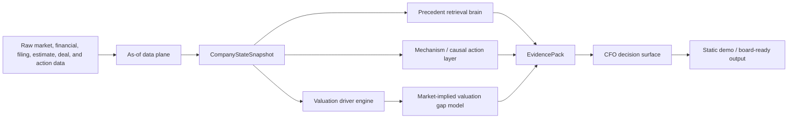

# Axiom

Corporate finance intelligence for valuation, capital allocation, and board-level action decisions.

Axiom is a research-grade decision engine that turns point-in-time company data, peer context, market pricing, precedent cases, and action-impact evidence into CFO-native recommendations. The system is built around a simple standard: every recommendation should be explainable, auditable, and tied to historical evidence.


## What This Shows

Axiom is not a dashboard wrapper around a spreadsheet. It is a layered modeling system:

- **Point-in-time company state**: as-of snapshots with provenance, confidence, fallback flags, and no look-ahead leakage.
- **Valuation driver engine**: peer-relative value surfaces that identify which business drivers explain valuation differences.
- **Market-implied gap model**: estimates what future driver changes the market appears to be pricing into a company's premium or discount.
- **Precedent retrieval brain**: finds similar historical corporate-action cases with learned distance weights and mismatch diagnostics.
- **Causal/action evidence layer**: validates whether specific action types have measurable stock, valuation, credit, or operating impact.
- **EvidencePack guardrail**: creates cited, structured evidence objects so user-facing output is grounded in source data rather than free-form narrative.
- **CFO decision surface**: translates the evidence into board-ready action reads, risk cases, and monitoring triggers.

## Why It Is Hard

Corporate finance decisions are usually evaluated with stale comps, hand-picked precedents, and informal judgment. Axiom tries to make those judgments testable.

The hard parts are:

- avoiding look-ahead bias when building company snapshots
- choosing peers without turning comps into a subjective list
- separating "this driver matters to valuation" from "the market is pricing a change in this driver"
- validating action impact without overclaiming causality
- keeping model output usable for CFOs and bankers, not just data scientists

## Architecture



See [docs/architecture.md](docs/architecture.md) for the deeper system map.

## Core Modules

| Layer | Code | What it does |
|---|---|---|
| As-of state | `src/company_state_builder.py` | Builds auditable company snapshots from market, financial, SEC, macro, and action inputs. |
| Data contract | `docs/data_contract.md` | Defines the bitemporal append-only warehouse contract. |
| Evidence layer | `src/evidence_pack.py` | Packages model output, citations, cohorts, objections, and action cards. |
| Company-state validation | `src/company_state_validation.py` | Checks point-in-time feature contracts, provenance, confidence, and fallback behavior. |
| Market expectations | `scripts/paper/run_market_expectations_experiments.py` | Runs the forward market-implied gap policy with walk-forward and placebo checks. |
| Paper package | `scripts/paper/run_market_expectations_experiments.py` | Reproducible market-expectations experiment runner with smoke fixtures, tables, placebos, and publication preset. |
| Precedents | `src/pipeline/precedent_brain.py` | Retrieves and scores similar historical corporate-action cases. |
| Learned distance | `src/pipeline/precedent_distance_v2_learning.py` | Tunes similarity weights by objective and action family. |
| Causal evidence | `src/causal_impact_model.py` | Models action-impact evidence with explicit risk and calibration contracts. |
| Board-ready output | `src/board_ready_dossier.py` | Shapes grounded evidence into a decision dossier with recommendation, sizing, and objections. |
| Recommendation runtime | `src/recommendation_run_orchestrator.py` | Orchestrates reproducible recommendation runs across the evidence layers. |
| Demo builder | `scripts/build_valuation_action_bridge.py` | Builds the static valuation/action bridge HTML demo. |

## Validation Snapshot

The current strongest public validation story is the market-implied valuation gap model:

| Validation | Result |
|---|---:|
| Operating companies attempted | 84 |
| Successful driver/horizon evaluations | 912 |
| Walk-forward train ends | 2014, 2016, 2018, 2020 |
| Test window | 2 years |
| Excluded sectors | Energy, Financials, Utilities, Real Estate |
| Best global lambda | 0.50 |
| Mean MAE improvement | 0.0074 |
| Placebo mean MAE improvement at lambda 0.50 | -0.0005 |
| Actual minus placebo | 0.0079 |
| Actual beats placebo | 63.5% |

See [docs/validation/README.md](docs/validation/README.md) for the broader validation map and model-card style notes.

## Publication Track

The market-implied valuation gap work now has a dedicated publication package under [paper/](paper/):

- methodology note: [paper/methodology.md](paper/methodology.md)
- model card: [paper/model_card_market_expectations.md](paper/model_card_market_expectations.md)
- manuscript scaffold: [paper/manuscript_skeleton.md](paper/manuscript_skeleton.md)
- public smoke fixture and generated smoke tables: [paper/results/smoke/](paper/results/smoke/)
- case-study decomposition artifacts: [paper/case_studies/](paper/case_studies/)

Run the public reproducibility check:

```bash
python scripts/paper/run_market_expectations_experiments.py --preset smoke
python scripts/paper/build_case_studies.py
```

Run the private-data empirical sweep:

```bash
python scripts/paper/run_market_expectations_experiments.py --preset publication
```

## Demo Case Study

The current flagship showcase is Home Depot's market-expectations view:

- example guide: [examples/hd_market_expectations/README.md](examples/hd_market_expectations/README.md)
- committed sample: `examples/hd_market_expectations/valuation_driver_data.sample.json`
- rebuild command: `python scripts/build_hd_market_expectations_demo.py`
- builder: `scripts/build_valuation_action_bridge.py`

The demo answers:

> How much of the market premium/discount is underwritten by validated forward driver expectations, and how much sits outside measured financial drivers?

## Showcase Gallery

For a broader application tour, see [docs/showcase.md](docs/showcase.md).

| Example | What it proves |
|---|---|
| [Market expectations](examples/hd_market_expectations/README.md) | Valuation gap decomposition and market-implied forward driver expectations. |
| [Company state snapshot](examples/company_state_snapshot/README.md) | Point-in-time features with provenance, confidence, units, and fallback flags. |
| [Precedent retrieval](examples/precedent_retrieval/README.md) | Historical action analogs with similarity, cohort outcomes, and mismatch diagnostics. |
| [CFO decision surface](examples/cfo_decision_surface/README.md) | Model evidence translated into action sizing, risk, regret, and board-ready recommendations. |

Print a compact summary of the committed showcase samples:

```bash
python scripts/inspect_showcase_gallery.py
```

## Repository Layout

```text
src/                       Core modeling and decision-surface modules
scripts/                   Builders, validation sweeps, and materialization scripts
tests/                     Unit and product-contract tests
docs/                      Architecture, data contracts, methodology, validation notes
docs/validation/           Curated validation summaries for public review
examples/                  Small guided case studies
paper/                     Publication methodology, smoke fixture, tables, and manuscript scaffold
configs/                   Model policies, routing overlays, and evaluation manifests
schemas/                   Company-state and input-layer JSON schemas
```

Generated data, private datasets, and scratch outputs are intentionally excluded from the public story. The active workspace contains many local artifacts under `data/`, `out/`, and `./data/`; those should be treated as reproducible build outputs or private source material, not as the primary GitHub surface.

## Quickstart

Install the lightweight analysis dependencies:

```bash
python -m pip install -r requirements.txt
```

Run the public showcase checks:

```bash
python -m pytest -q tests/test_public_showcase_examples.py tests/test_hd_market_expectations_demo.py tests/test_market_expectations_paper_package.py
```

Rebuild the public Home Depot demo from committed sample data:

```bash
python scripts/build_hd_market_expectations_demo.py
```

Run the public paper smoke package:

```bash
python scripts/paper/run_market_expectations_experiments.py --preset smoke
```

Open the rebuilt public sample:

```bash
open examples/hd_market_expectations/build/valuation_action_bridge.html
```

## What Axiom Does Not Claim

Axiom is deliberately conservative about language:

- peer valuation models are empirical association models, not causal proof
- generic causal labels are explanatory unless routed to concrete validated metrics
- thin action families can fall back to broader evidence rather than forcing a false "strong" label
- residual valuation gaps are explicitly labeled as outside the measured driver surface

That restraint is a feature. The goal is to build decision evidence a CFO could interrogate, not a black box that sounds confident.

## Public-surface boundary

This repository is the sanitized, reproducible research showcase for Axiom. It contains committed sample fixtures, schemas, model code, tests, and methodology notes; it does not contain production credentials, private warehouse data, or provider access tokens. The original working repository remains private because its ingestion adapters and local data workspace are not intended as a public API.

The public examples are intentionally runnable without paid data-provider accounts. Provider-backed ingestion scripts are retained as implementation context, but the documented path uses the committed sample fixtures and smoke panel.
