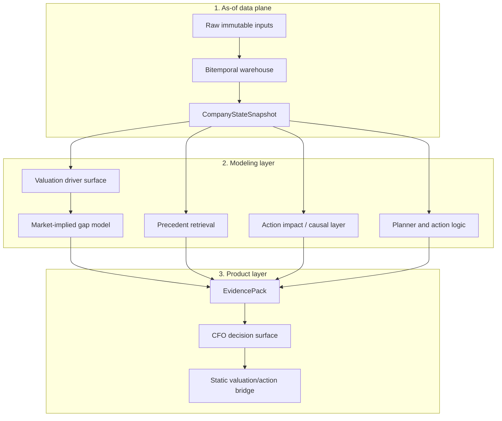

# Architecture

Axiom is organized as a layered corporate-finance decision engine. Each layer has a separate job: preserve point-in-time truth, model the company and market, retrieve historical analogs, validate action effects, then package the output into evidence a CFO can use.

## System Map

## 1. As-of Data Plane

The as-of layer is the foundation. It keeps market, financial, filing, event, estimate, macro, and private overlay data separate from model output.

Important files:

- `docs/data_contract.md`
- `docs/asof_views.md`
- `docs/quality_flags.md`
- `src/company_state_builder.py`
- `src/asof_store.py`

Design principles:

- raw data is append-only
- modeled features must carry provenance
- every feature has an as-of interpretation
- missing values stay explicit
- fallbacks are allowed only when flagged

## 2. Company State

`CompanyStateSnapshot` is the canonical runtime object. It collects the data needed to evaluate a company as of a specific date.

The snapshot layer tracks:

- feature value
- source input references
- confidence
- support mode
- fallback use
- quality flags
- component breakdowns

This is what lets downstream models explain where a value came from instead of only emitting a score.

