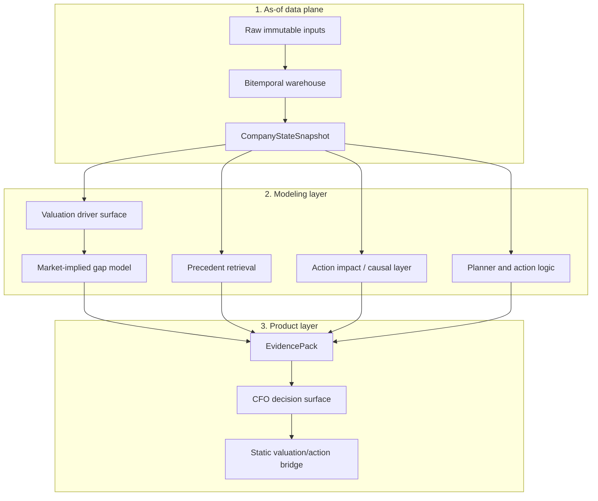

# Architecture

Axiom is organized as a layered corporate-finance decision engine. Each layer has a separate job: preserve point-in-time truth, model the company and market, retrieve historical analogs, validate action effects, then package the output into evidence a CFO can use.

## System Map

