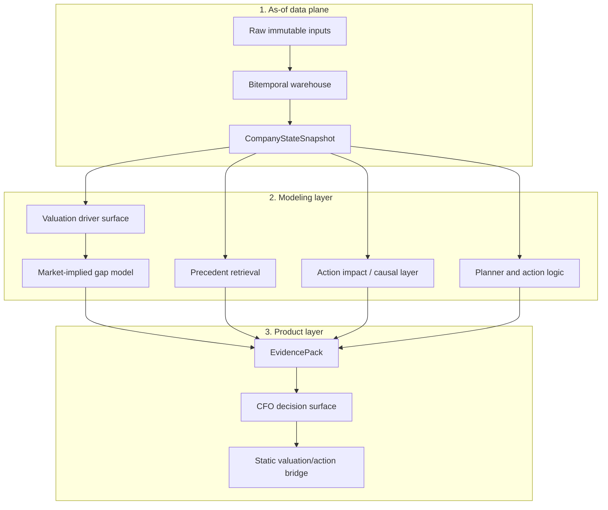

# Architecture

Axiom is organized as a layered corporate-finance decision engine. Each layer has a separate job: preserve point-in-time truth, model the company and market, retrieve historical analogs, validate action effects, then package the output into evidence a CFO can use.

This repository includes the data-plane, company-state, precedent, causal-impact, and recommendation code, plus committed examples. The valuation-driver and market-expectations sections also describe upstream analysis represented by those examples; the upstream data builders and full validation pipeline are not included. The file lists below identify the implementation and evidence available here.

## System Map



## 1. As-of Data Plane

The as-of layer is the foundation. It keeps market, financial, filing, event, estimate, macro, and private overlay data separate from model output.

Important files:

- `docs/data_contract.md`
- `docs/asof_views.md`
- `docs/quality_flags.md`
- `src/company_state_builder.py`
- `src/asof_store.py`

Design principles:

- raw data is append-only
- modeled features must carry provenance
- every feature has an as-of interpretation
- missing values stay explicit
- fallbacks are allowed only when flagged

## 2. Company State

`CompanyStateSnapshot` is the canonical runtime object. It collects the data needed to evaluate a company as of a specific date.

The snapshot layer tracks:

- feature value
- source input references
- confidence
- support mode
- fallback use
- quality flags
- component breakdowns

This is what lets downstream models explain where a value came from instead of only emitting a score.

## 3. Valuation Driver Engine

The valuation driver system answers:

> What business drivers explain valuation differences inside the relevant peer set?

It supports investor-native display lenses such as P/E and EV/EBITDA while routing driver weights through more stable value surfaces like P/Revenue or EV/Revenue when appropriate.

Included presentation, sample, and contract checks:

- `scripts/build_valuation_action_bridge.py`
- `scripts/build_hd_market_expectations_demo.py`
- `examples/hd_market_expectations/valuation_driver_data.sample.json`
- `tests/test_hd_market_expectations_demo.py`

These files rebuild the view from committed inputs. They do not regenerate the upstream valuation model or its source data.

The interpretation layer intentionally labels these as conditional peer-set associations, not causal recommendations.

## 4. Market-Implied Gap Model

The market-implied model answers a harder question:

> When the market pays a premium or applies a discount, which future driver changes does that premium or discount historically predict?

It compares two forecasts:

- a fundamentals-only forecast based on current level, recent momentum, and cycle context
- a market-gap enhanced forecast that adds the valuation premium or discount

If the gap-enhanced forecast improves out-of-sample MAE for a driver, the model treats that driver as market-priced. The current company gap is then allocated between validated driver expectations and a residual "outside measured drivers" bucket.

Included evaluation evidence and reproducibility checks:

- `examples/hd_market_expectations/forward_gap_placebo_walk_forward_operating_ex_energy.sample.md`
- `results/public_benchmark.json`
- `scripts/build_public_benchmark.py`
- `tests/test_public_benchmark_artifact.py`
- `MODEL_CARD.md`

The benchmark builder reproduces the JSON summary from the committed evaluation report. Re-running the underlying model evaluation requires the upstream pipeline and datasets, which are not included.

## 5. Precedent Retrieval

The precedent system retrieves similar historical action cases. It is not a text search feature; it uses company state, action type, regime context, outcome distributions, mismatch diagnostics, and calibrated confidence.

Important files:

- `src/pipeline/precedent_brain.py`
- `src/pipeline/precedent_distance_v2_learning.py`
- `src/pipeline/precedent_quality_learning.py`
- `tests/test_precedent_brain.py`
- `tests/test_precedent_distance_v2_learning.py`

The learned-distance layer tunes similarity weights by action family and objective so that analogs are retrieved for the decision being made, not just for superficial similarity.

## 6. Action Impact Layer

The action-impact layer evaluates whether action setups historically predict measurable outcomes.

Examples:

- short-window abnormal stock returns
- positive/material return classifiers
- valuation rerating
- credit spread movement
- leverage or rating changes
- operating metric movement

Important files:

- `src/causal_impact_model.py`
- `src/causal_benchmark.py`
- `src/causal_model_risk.py`
- `src/mechanism_brain.py`
- `tests/test_causal_impact_model.py`
- `tests/test_causal_benchmark.py`
- `tests/test_causal_model_risk.py`
- `tests/test_mechanism_causal_strict_gate.py`

The system deliberately separates metric-routed decision evidence from generic causal descriptions.

## 7. EvidencePack and CFO Surface

The final product layer packages output into evidence that can be reviewed.

Important files:

- `src/evidence_pack.py`
- `src/board_ready_dossier.py`
- `src/recommendation_run_orchestrator.py`
- `examples/cfo_decision_surface/cfo_decision_surface_hd.sample.json`
- `tests/test_example_contracts.py`

The committed sample includes a materialized CFO surface from upstream analysis and a dossier excerpt. The standalone upstream surface generator is not included; the dossier and recommendation modules listed above are available here.

The EvidencePack concept matters because it gives every user-facing claim a bounded data source. It is the bridge between quantitative models and board-ready language.

## Reproduce the Included Examples

From the repository root:

```bash
python scripts/inspect_examples.py
python scripts/build_public_benchmark.py --check
python scripts/build_hd_market_expectations_demo.py
```

These commands use committed sample inputs without licensed data-provider access. See the [repository tour](repository_tour.md) for the available examples and the [model card](../MODEL_CARD.md) for evaluation scope and limitations.
